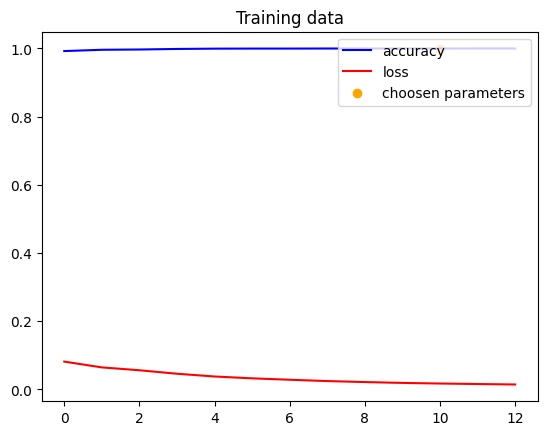
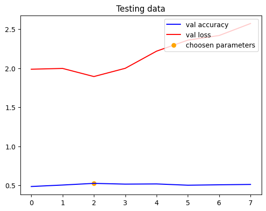

# Food Classification using Convolutional Neural Network (CNN)

This Python script implements a Convolutional Neural Network (CNN) for classifying food images into various categories. It uses the Food-101 dataset containing images of different food items.

## Requirements
- Python 3.x
- Required Libraries: `keras`, `matplotlib`, `numpy`, `seaborn`, `tensorflow`

## How to Use
1. Install the required libraries using pip.
2. Run the script.
3. Upload images of food items to classify.

## Description
- The script imports necessary libraries such as `keras`, `matplotlib`, `numpy`, `seaborn`, and `tensorflow`.
- It loads the Food-101 dataset images and preprocesses them for training and testing.
- A pre-trained InceptionV3 model is used for transfer learning, followed by additional layers for classification.
- The model is compiled and trained using the training data.
- Loss and accuracy plots are generated to visualize the training progress.
- The trained model is evaluated on the test data, and a confusion matrix is plotted to analyze the classification performance.
- Sample images of various food items are loaded and classified using the trained model.

## Video

https://github.com/Smit-Zaveri/PRODIGY_ML_05/assets/104667864/566f6fcd-741d-4745-9ce8-262b21d6a7a6

## Output
The script generates two plots:
1. Training Data: Shows the accuracy and loss during training.

2. Testing Data: Shows the accuracy and loss during testing.

Additionally, it displays a heatmap of the confusion matrix to analyze the classification performance. Sample images of food items are also loaded and classified, displaying the predicted class along with some additional information such as calorie count.

## Author
[Smit Zaveri](https://github.com/Smit-Zaveri/)

## Acknowledgments
- The Food-101 dataset used in this script is obtained from [\[source link\]](https://www.kaggle.com/datasets/dansbecker/food-101).
- Inspiration for this script is derived from [\[source link\]](https://www.kaggle.com/code/bebofekry/101-food-classification/notebook).
